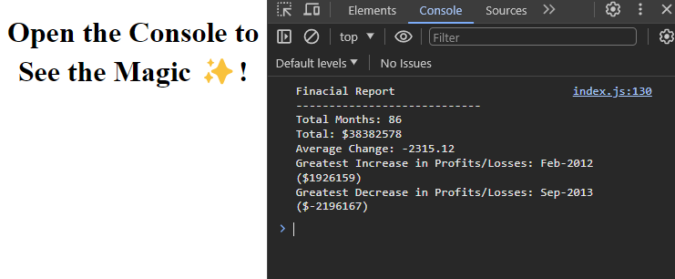

# Console Finances

## Description
This is a challenge I did for my bootcamp. I was tasked to create a console app that will analyse the data set I recieved in the starter files. I utalised the knowledge I had learn over the week as well as my own research to help me get to my final answer. In addition to this, I had been researching some good practices for JavaScript so I included an example of this in my answer.

## Screenshot

## Live
Link: https://rajpreetkr.github.io/console-finances/starter

## Credits
I used the following to help me get my answer and find out what the best coding practices as for JavaScript:
https://www.reddit.com/r/learnprogramming/comments/benm7w/when_should_i_use_var_vs_let_vs_const_in/
https://sentry.io/answers/how-to-find-the-sum-of-an-array-of-numbers/
https://www.w3schools.com/jsref/jsref_tofixed.asp

## Lisence
MIT License
